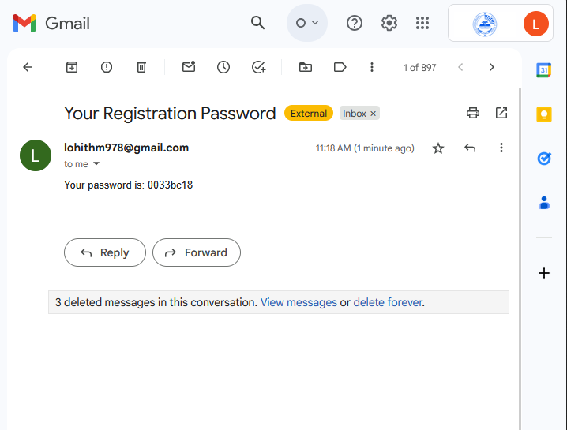
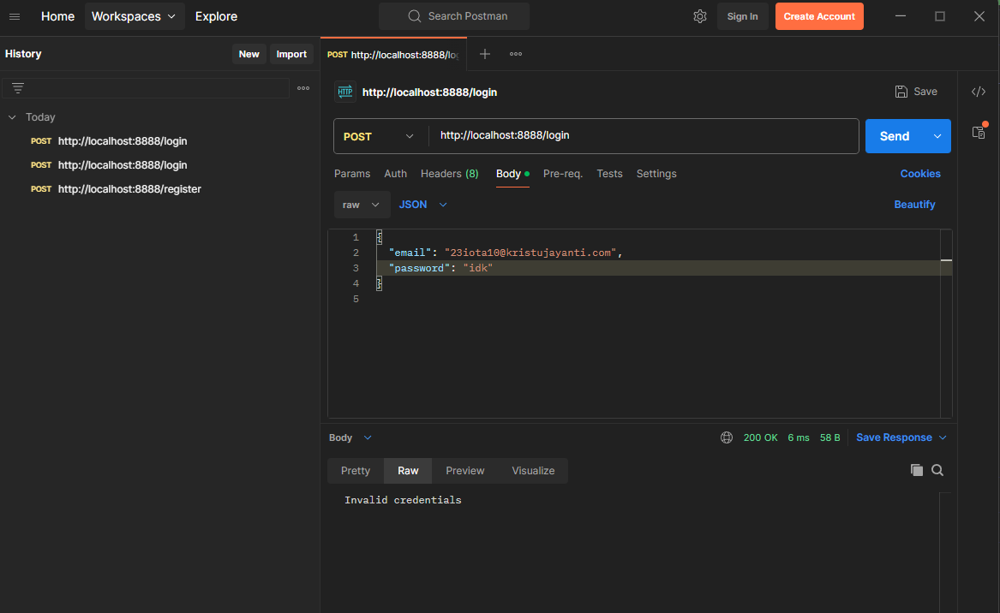
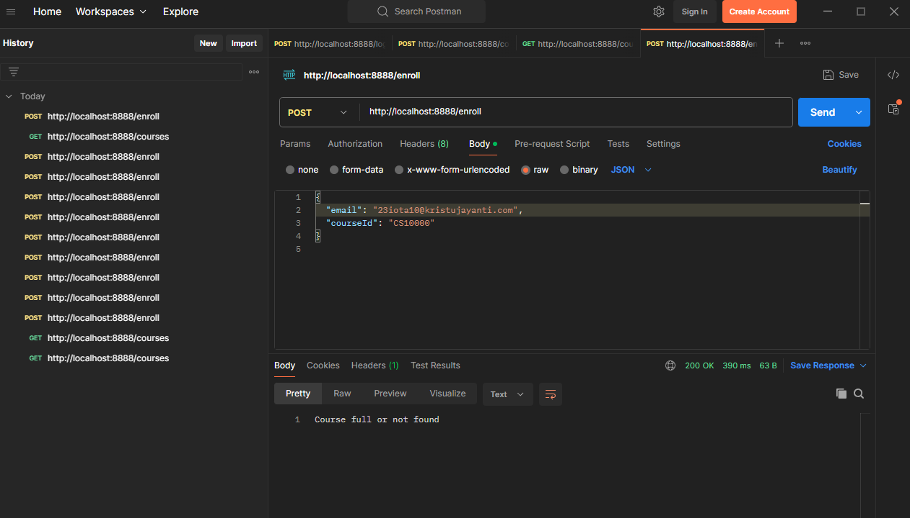
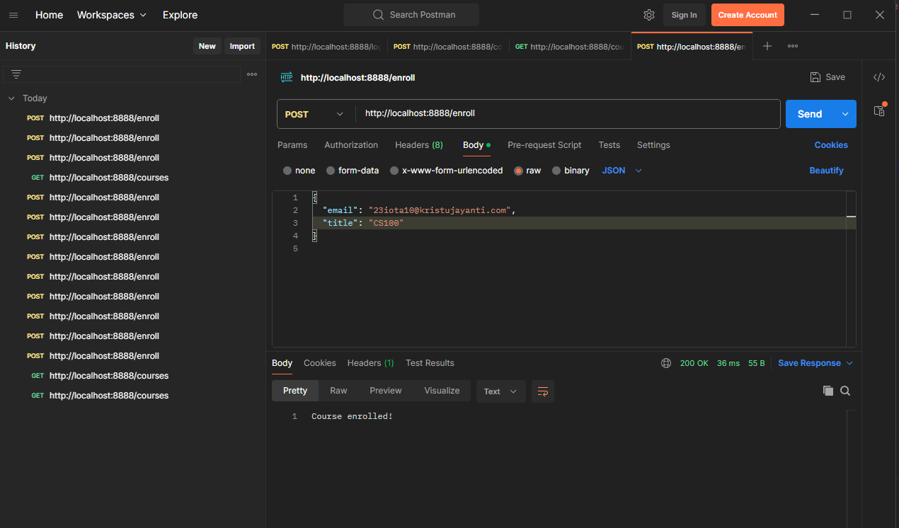
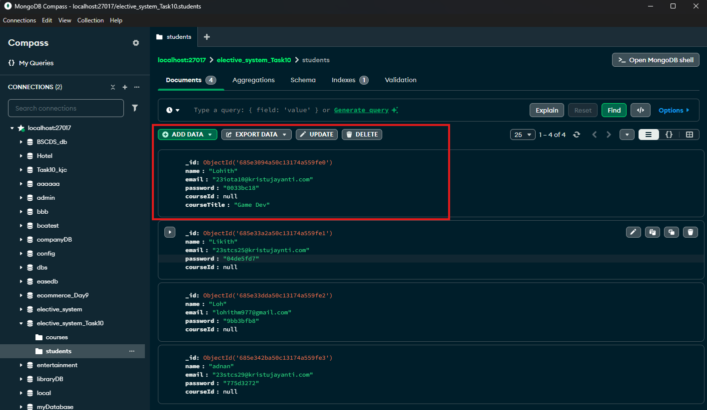

#  Day 10 Task

---

## 23IOTA10
Designed a **Java-based Elective Course Registration** System using ***MongoDB,Vertx and Postman***
- Students register for elective course selection.✅
- A random password is generated and emailed to the student upon registration.✅
- Students log in using their email and the password they received.✅
- After login, they can view available elective courses and register for one.✅
- The course's available seat count is reduced by one after a successful registration✅

## Technologies Used
- Java 17
- Vert.x Web
- MongoDB Compass (mongodb://localhost:27017)
- Postman (for API testing)
- SMTP (for email sending via Gmail)

---

## Project Structure

```
src
└── main
    └── java
        └── in
            └── edu
                └── kristujayanti
                    ├── Main.java              
                    ├── MongoConnection.java    
                    ├── handlers
                    │   ├── StudentHandler.java # 
                    │   └── CourseHandler.java  
                    └── services
                        ├── StudentService.java 
                        ├── CourseService.java  
                        └── EmailService.java   
```

---

## screenshots 

### 1️. Registration



### 2️. Login



### 3️. Courses



### 4️. Get Courses


### 5️. Enroll in Course




---

## method explaination

| File | Purpose |
|------|---------|
| `Main.java` | Bootstraps the Vert.x server and registers handlers |
| `MongoConnection.java` | Provides `MongoDatabase` instance |
| `StudentHandler.java` | Defines student-related endpoints |
| `CourseHandler.java` | Defines course-related endpoints |
| `StudentService.java` | Core student logic: register, login, enroll |
| `CourseService.java` | Adds and retrieves courses |
| `EmailService.java` | Sends registration email using Vert.x MailClient |


## Endpoints explanation

| Method | Endpoint         | endpoints                     | Body (JSON) Example                                      |
|--------|------------------|-------------------------------|----------------------------------------------------------|
| POST   | /register        | Register a new student        | { "name": "abc", "email": "abc@example.com" }`           |
| POST   | /login           | Login with email and password | { "email": "john@example.com", "password": "abcd1234" }` |
| POST   | /enroll          | Enroll student in a course    | { "email": "doe@example.com", "courseId": "CS101" }`     |
| GET    | /courses         | Get list of all courses       |                                                          |

***The project uses Vert.x Mail Client to send registration passwords to students via email. SMTP is configured for Gmail by the steps given:***
**Steps to Generate a Google App Password**

1. **Login** to your Google Account
2. Go to the Security tab.
3. find and click **App Passwords** under "Signing in to Google". .
4. For "Select device"and enter a name.
5. Click generate.
6. Copy the 16-character password shown use it in the project.

This project is a educational task given to **23IOTA10**